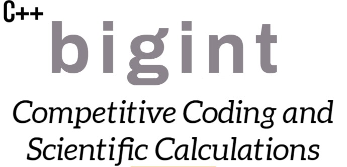

[![c++][c++-shield]][c++-url]
[![License][license-shield]][license-url]
<!-- [![CodeCov][codecov-shield]][codecov-url] -->

<!-- MARKDOWN LINKS & IMAGES -->
<!-- https://www.markdownguide.org/basic-syntax/#reference-style-links -->
[c++-shield]: https://img.shields.io/badge/C++-Solutions-blue.svg?style=flat&logo=c%2B%2B
[c++-url]: https://img.shields.io/badge/-c++-black?logo=c%2B%2B&style=social
[license-shield]: https://img.shields.io/github/license/RutvikRJ6800/Big-Integer-Cpp
[license-url]: https://github.com/RutvikRJ6800/Big-Integer-Cpp/blob/main/LICENSE

<!-- PROJECT LOGO -->
<br />
<div align="center">
    
  </a>

  <h3 align="center">Perform arithmatic operations on large digit numbers.</h3>

  <p align="center">
    A simple c++ header file containing fuctions for calulating addition, subtraction, multiplication, division, modulo, gcd, factorial, exponent of large numbers that doesn't fit into int or long long int data type.
    <br />
    🎉 Versio0n 0.0.1 is out. Check out the release notes
  </p>
</div>

# 💡 What is Big Integer Library?

Big Integer Library contains fuctions related to various arithmatic operations like
addition, subtraction, multiplication, division, modulo, gcd, factorial, exponent on large numbers that doesn't fit into int or long long int data type.

# 🤸 Getting Started

## 💾 How to use .?
Include bigInt.h Header file into your c++ file using below code:

```cpp
#include "bigInt.h"
```
> **Note** - Big Integer Library supports C++11, C++14, and C++17.

## 🏇 Below are the examples of functions.

If you want to add two large numbers:

```cpp
string num1 = "16546313156645";
string num2 = "48798451351";
string result = add(num1, num2);
cout<<result<<endl;
```

If you want to subtract two large numbers:

```cpp
string num1 = "232688975318412";
string num2 = "116445186451";
string result = sub(num1, num2);
cout<<result<<endl;
```
> **Note** - Don't subtract bigger number from smaller number to get the correct result.

If you want to multiply two large numbers:

```cpp
string num1 = "12168412158";
string num2 = "86746564554988";
string result = multiplication(num1, num2);
cout<<result<<endl;
```

If you want to divide two large numbers:

```cpp
string num1 = "15464841654645598";
string num2 = "787665431513216";
string result = division(num1, num2);
cout<<result<<endl;
```

If you want to find factorial of large number:

```cpp
string num = "9875114";
string result = factorial(num);
cout<<result<<endl;
```

If you want to find gcd of two large numbers:

```cpp
string num1 = "15464841654645598";
string num2 = "787665431513216";
string result = gcd(num1, num2);
cout<<result<<endl;
```

If you want to find modulo of two large numbers:

```cpp
string num1 = "15464841654645598";
string num2 = "787665431513216";
string result = modulo(num1, num2);
cout<<result<<endl;
```

If you want to find exponent of two large numbers:

```cpp
string num1 = "15464841654645598";
string num2 = "787665431513216";
string result = exponent(num1, num2);
cout<<result<<endl;
```

If you want to solve expression containing addition(+), subtraction(-) and multiplication(x) then:

```cpp
string expr = "2587+58796412576587465575+6585668511236+254785478x131648484584564x1654-5448765463153148512";
string result = solveExpression(expr);
cout<<result<<endl;
```
> **Note** - Use x (lower case X) in expression for multiplication operator.

> **Note** - Expression should not produces negative result at any step during the evaluation.

# 📜 License

This is distributed under the terms of the GNU General Public License 3.0. 
A complete version of the license is available in the [LICENSE](LICENSE) file in
this repository. Any contribution made to this project will be licensed under
the GNU General Public License v3.0.
